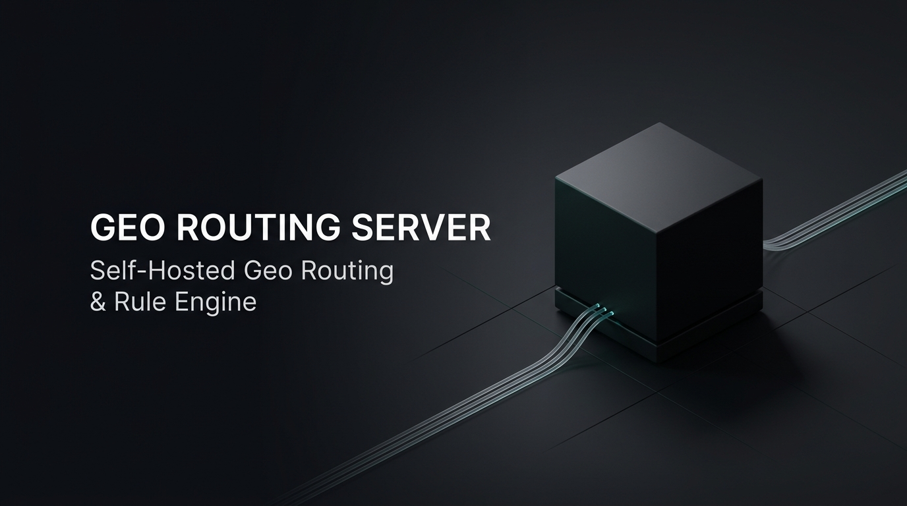

<div align="center">



# 🚀 Geo Routing Server

**Self-Hosted сервис для автономной раздачи geo-баз (`geoip.dat`, `geosite.dat`) и правил маршрутизации трафика (`HAPP`, `INCY`) с высокой доступностью и локальным кэшированием.**

[](https://github.com/xdeptu5/geo-routing-server)
[](https://github.com/xdeptu5/geo-routing-server/pkgs/container/geo-routing-server)
[](https://www.python.org)
[](https://nginx.org)
[](./LICENSE)
[](https://github.com/xdeptu5/geo-routing-server)

</div>

---

## 📌 Возможности

* 🛡️ **Полная автономность:** базы `geoip.dat`, `geosite.dat` и правила раздаются напрямую с вашего VPS — клиенты не зависят от доступности GitHub или сторонних CDN.
* 📱 **Поддержка Happ и Incy:** генерация Base64-диплинков для Happ (`.DEEPLINK`) и динамических JSON-правил подписки для Incy (`.JSON`).
* ⚡ **Нативная интеграция с Remnawave API:** прямое автообновление правил сквадов без сторонних скриптов (поддерживается до 10+ сквадов и Cloudflare Zero Trust).
* 🔒 **Безопасность:** закрытый доступ по секретному URL-токену (`/<ROUTING_TOKEN>/...`). Без токена сервер не отвечает сканерам.
* 🚀 **ETag-кэширование (304 Not Modified):** базы загружаются только при реальных изменениях у источника.
* 📁 **Гибкость источников:** официальный репозиторий [roscomvpn-routing](https://github.com/hydraponique/roscomvpn-routing), кастомные URL или локальные базы в `./custom_geo/`.
* 🤖 **Telegram-уведомления:** мгновенные алерты об ошибках и отчёты о новых базах (с поддержкой топиков).
* 📦 **Zero Dependencies:** один контейнер (Alpine + Python 3 + Nginx), архитектуры `amd64` и `arm64`.

---

## 📖 Архитектура

```text
 ┌───────────────────────────────────────────────────────────┐
 │   Источники: roscomvpn-routing / Custom URLs / ./custom_geo/│
 └─────────────────────────────┬─────────────────────────────┘
                               │ (ETag 304, SHA-256, atomic write)
                               ▼
 ┌───────────────────────────────────────────────────────────┐
 │   Docker [ geo-routing-server ]                           │
 │   • Планировщик crond (обновление по расписанию)          │
 │   • Python-ядро (адаптация URL на локальные, генерация)   │
 │   • Nginx (отдача статики с поддержкой ETag)              │
 │   • Нативная отправка правил в Remnawave API              │
 └─────────────────────────────┬─────────────────────────────┘
                               │ (127.0.0.1:8080 -> HTTPS Прокси)
                               ▼
 ┌───────────────────────────────────────────────────────────┐
 │   Клиенты и Панели:                                       │
 │   • Incy: заголовок подписки autorouting (pull JSON)      │
 │   • Happ: импорт диплинка или автопатч сквада Remnawave   │
 │   • Базы: скачивание geoip.dat / geosite.dat по HTTPS     │
 └───────────────────────────────────────────────────────────┘
```

---

## 🚀 Установка и запуск

### ⭐️ Способ 1. Автоматический мастер установки (Рекомендуется)

Самый быстрый и надёжный способ развёртывания. Скрипт проверит окружение, сгенерирует криптографически стойкий токен, настроит конфигурацию и запустит сервис:

```bash
bash <(curl -fsSL https://raw.githubusercontent.com/xdeptu5/geo-routing-server/main/install.sh)
```

> 💡 **Удобное управление через команду `geoserver`:**  
> После установки в любой момент введите `geoserver` в терминале для вызова интерактивной панели:
> * 📊 **Мониторинг:** просмотр статуса, логов в реальном времени и публичных ссылок на файлы
> * ⚙️ **Настройки:** управление выборочной раздачей правил (`JSONSUB`, `WHITELIST`) и форматов (`CLIENT_OPTIMIZED`)
> * 🌐 **HTTPS Реверс-прокси:** встроенный генератор готовых конфигов для **Caddy**, **Nginx** и **Nginx Proxy Manager**
> * 🔄 **Обновления:** автоматическое отслеживание и установка новых версий скрипта и Docker-образа в 1 клик

---

<details>
<summary><b>🛠️ Способ 2. Ручной запуск через Docker Compose (Portainer / Dockge / 1Panel)</b></summary>
<br>

Если вы управляете стеками через **Dockge**, **Portainer**, **1Panel**, **Coolify** или разворачиваете сервис через CI/CD:

1. **Создайте `compose.yaml`:**
   ```yaml
   services:
     geo-routing-server:
       image: ghcr.io/xdeptu5/geo-routing-server:latest
       container_name: geo-routing-server
       restart: unless-stopped
       env_file:
         - .env
       ports:
         - "${HTTP_BIND:-127.0.0.1}:${HTTP_PORT:-8080}:80"
       volumes:
         - routing_data:/app/www
         - ./.cache:/app/.cache
         - ./custom_geo:/app/custom_geo:ro
       healthcheck:
         test: ["CMD", "wget", "-q", "-O", "/dev/null", "http://127.0.0.1:80/health"]
         interval: 30s
         timeout: 5s
         retries: 3
         start_period: 10s

   volumes:
     routing_data:

   # Для прямого подключения к сети панели Remnawave раскомментируйте:
   # networks:
   #   remnawave:
   #     external: true
   #     name: "${DOCKER_NETWORK:-remnawave-network}"
   ```

2. **Создайте файл конфигурации `.env`:**  
   Скопируйте шаблон из [`.env.example`](./.env.example) и настройте базовые параметры:
   ```env
   DOMAIN=geo.example.com
   ROUTING_TOKEN=сгенерируйте_случайный_токен_openssl_rand_hex_16
   ENABLED_CLIENTS=HAPP,INCY
   ROUTING_RULES=JSONSUB,WHITELIST
   SERVE_FORMATS=CLIENT_OPTIMIZED
   HTTP_PORT=8080
   SCHEDULE=0 10 * * *
   SYNC_ON_START=true
   ```

3. **Запустите контейнер:**
   ```bash
   docker compose up -d
   ```

4. **Проверьте работоспособность:**
   ```bash
   docker compose ps
   curl -fsS http://127.0.0.1:8080/health
   docker compose logs --tail=50
   ```
   > Статус `healthy` и строка `Synchronization completed successfully.` в логах подтверждают успешный запуск.

</details>


---

## 🗺️ Сценарии развертывания

Сервис гибко настраивается под любую архитектуру сети через файл `.env` (или интерактивно в мастере `install.sh`):

| Сценарий | Название режима | Когда использовать | Основной модуль (`ENABLED_CLIENTS`) |
| :---: | :--- | :--- | :--- |
| **1** | **Всё в одном** | Раздача баз и правил по HTTPS + автопатч сквадов Remnawave | `HAPP,INCY` + Remnawave API |
| **2** | **Сервер раздачи** | Автономная раздача баз и правил по HTTPS (без Remnawave) | `HAPP,INCY` (или только один клиент) |
| **3** | **Выделенный узел баз (Geo-Node)** | Раздача только файлов `geoip.dat` и `geosite.dat` на высокой скорости | `HAPP_GEO,INCY_GEO` |
| **4** | **Интеграция с Remnawave** | Генератор диплинков для сквадов Remnawave (базы на внешнем сервере) | `HAPP_DEEPLINK` (домен не требуется) |
| **5** | **Только правила Incy** | Раздача JSON-подписки Incy по HTTPS, базы на внешнем узле | `INCY` + `PUBLIC_GEO_BASE_URL` |

<details>
<summary><b>📋 Примеры готовых конфигураций .env под каждый сценарий</b></summary>
<br>

#### 1. Всё в одном (Раздача файлов + Remnawave API)
Раздаёт базы и правила по HTTPS, а также автоматически обновляет правила маршрутизации в сквадах панели Remnawave:
```env
DOMAIN=geo.example.com
ROUTING_TOKEN=секретный_токен
ENABLED_CLIENTS=HAPP,INCY
ROUTING_RULES=JSONSUB,WHITELIST
SERVE_FORMATS=CLIENT_OPTIMIZED
REMNAWAVE_BASE_URL=http://remnawave:3000/api
REMNAWAVE_TOKEN=jwt_токен_администратора
REMNAWAVE_SQUAD_1_UUID=uuid_первого_сквада
REMNAWAVE_SQUAD_1_RULE=JSONSUB.JSON
```

#### 2. Сервер раздачи (Pull-модель без Remnawave)
Классический файловый сервер. Базы и конфигурации забираются клиентами и панелями (Marzban, 3x-ui, Remnawave) по прямым HTTPS-ссылкам:
```env
DOMAIN=geo.example.com
ROUTING_TOKEN=секретный_токен
ENABLED_CLIENTS=HAPP,INCY
ROUTING_RULES=JSONSUB,WHITELIST
SERVE_FORMATS=CLIENT_OPTIMIZED
```

#### 3. Выделенный узел раздачи geo-баз (Geo-Node)
Сервер раздаёт только базы `geoip.dat` и `geosite.dat` без генерации правил маршрутизации (минимальная нагрузка):
```env
DOMAIN=geo-node.example.com
ROUTING_TOKEN=секретный_токен
ENABLED_CLIENTS=HAPP_GEO,INCY_GEO
```

#### 4. Интеграция с Remnawave (базы на внешнем узле)
Работает в изолированном Docker-окружении рядом с Remnawave. **Публичный домен и открытые веб-порты не требуются.** Правила генерируются и сразу пушатся в API сквадов:
```env
ENABLED_CLIENTS=HAPP_DEEPLINK
PUBLIC_GEO_BASE_URL=https://geo-node.example.com/секретный_токен
REMNAWAVE_BASE_URL=http://remnawave:3000/api
REMNAWAVE_TOKEN=jwt_токен_администратора
REMNAWAVE_SQUAD_1_UUID=uuid_сквада
REMNAWAVE_SQUAD_1_RULE=JSONSUB.JSON
```

#### 5. Сервер правил Incy (с внешними базами)
Раздает по HTTPS JSON-правила для Incy, а адреса загрузки баз внутри правил ведут на выделенный гео-узел:
```env
DOMAIN=geo.example.com
ROUTING_TOKEN=секретный_токен
ENABLED_CLIENTS=INCY
PUBLIC_GEO_BASE_URL=https://geo-node.example.com/секретный_токен
```

</details>


---

## 📱 Подключение клиентов

### HAPP
Happ принимает правила через Base64-диплинк `happ://routing/onadd/<base64>`.
* **С Remnawave:** правила обновляются в сквадах автоматически через API (Сценарии 1 и 4).
* **Вручную / другие панели:** скопируйте ссылку на сгенерированный файл:
  ```text
  https://<DOMAIN>/<ROUTING_TOKEN>/HAPP/<RULE>.DEEPLINK
  ```
  Примеры:
  * `https://geo.example.com/<ROUTING_TOKEN>/HAPP/JSONSUB.DEEPLINK`
  * `https://geo.example.com/<ROUTING_TOKEN>/HAPP/WHITELIST.DEEPLINK`

### INCY
Клиент Incy динамически скачивает JSON-правила по HTTPS. В панели (Remnawave, Marzban, 3x-ui) добавьте заголовок профиля подписки:
* **Header Name:** `autorouting`
* **Header Value:**
  ```text
  incy://autorouting/onadd/https://<DOMAIN>/<ROUTING_TOKEN>/INCY/<RULE>.JSON
  ```
  Примеры:
  * `incy://autorouting/onadd/https://geo.example.com/<ROUTING_TOKEN>/INCY/JSONSUB.JSON`
  * `incy://autorouting/onadd/https://geo.example.com/<ROUTING_TOKEN>/INCY/WHITELIST.JSON`

---

<details>
<summary><b>⚙️ Полный справочник всех параметров конфигурации (.env)</b></summary>
<br>

| Переменная | По умолчанию | Описание |
| :--- | :--- | :--- |
| `DOMAIN` | `geo.example.com` | Домен для HTTPS-прокси (не нужен в режиме `HAPP_DEEPLINK`) |
| `ROUTING_TOKEN` | — | **Обязательно** для раздачи файлов: минимум 4 символа из `[A-Za-z0-9_-]`; установщик генерирует 32-символьный токен |
| `ENABLED_CLIENTS` | `HAPP,INCY` | Модули: `HAPP,INCY`, `HAPP`, `INCY`, `HAPP_GEO`, `INCY_GEO`, `HAPP_DEEPLINK` |
| `ROUTING_RULES` | `JSONSUB,WHITELIST` | Выборочные правила маршрутизации: `JSONSUB,WHITELIST`, `JSONSUB`, `ALL` или кастомный список через запятую |
| `SERVE_FORMATS` | `CLIENT_OPTIMIZED` | Форматы файлов: `CLIENT_OPTIMIZED` (Happ → `.DEEPLINK`, Incy → `.JSON`), `ALL`, `JSON`, `DEEPLINK` |
| `SERVE_GEOIP` | `true` | Раздача файла `geoip.dat` (`true` / `false`) |
| `SERVE_GEOSITE` | `true` | Раздача файла `geosite.dat` (`true` / `false`) |
| `PUBLIC_GEO_BASE_URL` | *пусто* | Внешний URL баз (`https://geo-node.example.com/<token>`) |
| `DOCKER_NETWORK` | `remnawave-network` | Имя существующей сети Remnawave; применяется блоком `networks` в `compose.yaml` |
| `HTTP_BIND` | `127.0.0.1` | IP привязки внутреннего веб-сервера |
| `HTTP_PORT` | `8080` | Порт для реверс-прокси |
| `SCHEDULE` | `0 10 * * *` | Расписание автообновления (cron UTC, дефолт 10:00 UTC) |
| `SYNC_ON_START` | `true` | Выполнять синхронизацию при запуске контейнера |
| `GEOIP_SOURCE_URL` | *пусто* | Кастомный источник `geoip.dat` |
| `GEOSITE_SOURCE_URL` | *пусто* | Кастомный источник `geosite.dat` |
| `ROUTING_SOURCE_REPO` | *roscomvpn* | Репозиторий правил GitHub |
| **Telegram** | | |
| `TELEGRAM_BOT_TOKEN` | *пусто* | Токен бота Telegram для алертов |
| `TELEGRAM_CHAT_ID` | *пусто* | ID чата / группы |
| `TELEGRAM_THREAD_ID` | *пусто* | ID темы/топика в супергруппе |
| `TELEGRAM_NOTIFY_SUCCESS`| `false` | Уведомлять при каждом успешном обновлении |
| **Remnawave API** | | |
| `REMNAWAVE_BASE_URL` | *пусто* | URL API панели (например, `http://remnawave:3000/api`) |
| `REMNAWAVE_TOKEN` | *пусто* | JWT-токен администратора панели |
| `REMNAWAVE_SQUAD_N_UUID` | *пусто* | UUID сквада N (N = 1..10+) |
| `REMNAWAVE_SQUAD_N_NAME` | *пусто* | Читаемое имя сквада N (подтягивается из API автоматически) |
| `REMNAWAVE_SQUAD_N_RULE` | `JSONSUB.JSON` | Имя правила для сквада N (`JSONSUB.JSON`, `WHITELIST.JSON`) |
| `REMNAWAVE_GLOBAL_RULE` | *пусто* | Глобальное правило для всех подписок |
| `CLOUDFLARE_ZERO_TRUST_CLIENT_ID` | *пусто* | Client ID сервисного токена Cloudflare Zero Trust |
| `CLOUDFLARE_ZERO_TRUST_CLIENT_SECRET` | *пусто* | Client Secret сервисного токена Cloudflare Zero Trust |

</details>

---

## 🌐 Настройка HTTPS Реверс-Прокси

Поддерживаются два основных сценария подключения:
1. **Отдельный субдомен** (например, `geo.example.com`).
2. **Существующий сайт** (проксирование только путей `/<ROUTING_TOKEN>/` без выделения нового домена).

> 💡 **Автоматическая генерация конфигов:**  
> Интерактивный генератор готовых конфигов под ваш домен и порт встроен прямо в меню `geoserver` (пункт `3`).

<details>
<summary><b>📄 Примеры конфигураций для Caddy и Nginx</b></summary>
<br>

**Caddy (субдомен):**
```caddy
geo.example.com {
    reverse_proxy 127.0.0.1:8080
}
```

**Nginx (субдомен):**
```nginx
server {
    listen 443 ssl;
    server_name geo.example.com;
    ssl_certificate /etc/letsencrypt/live/geo.example.com/fullchain.pem;
    ssl_certificate_key /etc/letsencrypt/live/geo.example.com/privkey.pem;
    location / {
        proxy_pass http://127.0.0.1:8080;
        proxy_set_header Host $host;
        proxy_set_header X-Real-IP $remote_addr;
        proxy_set_header X-Forwarded-For $proxy_add_x_forwarded_for;
        proxy_set_header X-Forwarded-Proto $scheme;
    }
}
```

</details>


---

## 🛠️ Управление и команды

Основное администрирование выполняется через интерактивное меню `geoserver`:

| Действие | Команда / Пункт меню | Описание |
|---|---|---|
| **Главное меню** | `geoserver` | Интерактивное TUI-меню управления сервером |
| **Синхронизация баз** | Пункт `1` или `docker exec geo-routing-server run-routing-sync` | Принудительный запуск обновления баз и правил |
| **Публичные ссылки** | Пункт `2` | Просмотр ссылок на базы, диплинков Happ и заголовка Incy |
| **Конфиги реверс-прокси** | Пункт `3` | Интерактивный генератор конфигов (Caddy / Nginx / NPM) |
| **Настройки интеграций** | Пункт `4` | Настройка подключения к Remnawave API и Telegram-боту |
| **Перенастройка параметров**| Пункт `5` | Повторный запуск пошагового мастера (правила, форматы, базы) |
| **Просмотр логов** | Пункт `6` или `docker compose logs -f` | Мониторинг логов контейнера в реальном времени |
| **Управление контейнером** | Пункт `7` | Безопасный перезапуск или остановка контейнера |
| **Обновление сервиса** | Пункт `8` | Обновление Docker-образа из GHCR и скрипта управления |
| **Дополнительно** | Пункт `9` | Смена языка интерфейса (RU/EN), системная информация, удаление |
| **Выход** | Пункт `10` или клавиша `q` / `0` | Быстрый выход из меню управления |

> 💡 **Автоматическая проверка обновлений:**  
> При каждом открытии `geoserver` проверяет наличие свежих релизов скрипта на GitHub и новых сборок Docker-образа в GHCR. При обнаружении обновлений уведомление выводится прямо в шапке и подсвечивает соответствующие пункты меню.

> 📁 **Кастомные базы:** Локальные файлы `geoip.dat` и `geosite.dat` можно положить в папку `./custom_geo/` — сервер подхватит их автоматически вместо загрузки из сети.

---

## ❓ FAQ

<details>
<summary><b>Как устроена защита токеном и доступ к файлам?</b></summary>
Прямой просмотр каталогов (листинг файлов) отключён. При обращении к корню сервер отдаёт статус <code>geo-routing-server is running</code>. Все базы и конфигурации отдаются исключительно по секретному URL-префиксу: <code>https://geo.example.com/&lt;ROUTING_TOKEN&gt;/...</code>. Без знания токена сканеры и сторонние лица не имеют доступа к вашим файлам.
</details>

<details>
<summary><b>Что происходит при повторном запуске install.sh?</b></summary>
Скрипт автоматически распознает существующую установку и открывает меню <code>geoserver</code>. Параметры и рабочие данные никогда не перезаписываются без явного подтверждения.
</details>

---

<a id="donate"></a>
## 💎 Поддержать проект (Donations)

* **USDT / TRX (TRC20):** `TKw6b3ZszCM2983sLuFAvqxtt2M8hpNW51`
* **TON:** `UQB19xcTuQ1jFEq0Pi3xaABnN8JaGEXAeuGa2rXFRUUdi8Nk`
* **USDT / BNB (BEP20):** `0xFdc848534deA4f010c95df92045ABDa5f6a1559b`

---

## 📄 Лицензия

Распространяется под свободной лицензией [MIT](./LICENSE).
