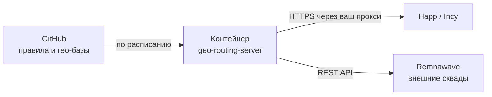

<div align="center">


# Geo Routing Server

**Свой сервер правил маршрутизации и гео-баз для VPN-клиентов Happ и Incy — с автообновлением и интеграцией с Remnawave.**

[](https://github.com/xdeptu5/geo-routing-server)
[](https://github.com/xdeptu5/geo-routing-server/pkgs/container/geo-routing-server)
[](https://www.python.org)
[](./LICENSE)

</div>

---

## Что это

VPN-клиенты **Happ** и **Incy** умеют разделять трафик: российские сайты и сервисы идут напрямую, заблокированные — через VPN. Для этого им нужны **правила маршрутизации** и **гео-базы** (`geoip.dat`, `geosite.dat`) — списки IP-адресов и доменов по категориям.

Эти файлы публикуют сообщества на GitHub и регулярно обновляют. Без этого сервиса администратору приходится самому следить за релизами, скачивать файлы, переписывать в правилах ссылки на базы, кодировать правила в диплинки для Happ и вручную обновлять их в панели **Remnawave**.

**Geo Routing Server делает это автоматически.** Он работает в одном Docker-контейнере на вашем сервере и по расписанию:

1. забирает свежие правила и гео-базы из выбранного источника;
2. подставляет в правила ссылки на базы с вашего домена;
3. раздаёт готовые файлы клиентам по секретной HTTPS-ссылке;
4. обновляет правила в сквадах Remnawave, если панель подключена.

Клиенты получают правила и базы с вашего сервера и не зависят от доступности GitHub.

**Для кого:** администраторы VPN-сервисов на Xray/V2Ray, особенно на панели Remnawave, которые раздают клиентам Happ или Incy готовую маршрутизацию для РФ.

> **Версия:** `v1.5.2` · [История изменений](CHANGELOG.md)

## Содержание

- [Как это работает](#how-it-works)
- [Термины](#glossary)
- [Требования](#requirements)
- [Быстрый старт](#quick-start)
- [Подключение клиентов](#clients)
- [Интеграция с Remnawave](#remnawave)
- [Сценарии развёртывания](#scenarios)
- [Источники правил (пресеты)](#presets)
- [Параметры конфигурации](#configuration)
- [Управление](#management)
- [Эксплуатация и безопасность](#operations)
- [Решение проблем](#troubleshooting)
- [Разработка](#development)

---

<a id="how-it-works"></a>
## Как это работает


```mermaid
flowchart LR
    SRC["GitHub<br/>правила и гео-базы"] -->|по расписанию| CONTAINER["Контейнер<br/>geo-routing-server"]
    CONTAINER -->|HTTPS через ваш прокси| CLIENTS["Happ / Incy"]
    CONTAINER -->|REST API| REMNA["Remnawave<br/>внешние сквады"]
```

- **Синхронизация** запускается при старте контейнера и по расписанию cron (по умолчанию ежедневно в 10:00 UTC).
- **Загрузка экономная и устойчивая.** Неизменившиеся файлы не скачиваются повторно (ETag). Если основной источник недоступен, сервис пробует резервные (официальные релизы v2fly, MetaCubeX, runetfreedom). Если не отвечает ни один, продолжает раздавать последнюю рабочую копию.
- **Публикация атомарная.** Клиенты никогда не получают недописанный файл, а при сбое остаются предыдущие версии.
- **Раздача** идёт через встроенный Nginx на `127.0.0.1:8080`. Наружу по HTTPS сервис выставляет ваш обратный прокси (Caddy или Nginx). Файлы доступны только по пути с секретным токеном: `https://<домен>/<токен>/...`.
- **Управление** — командой `geoserver` на хосте (интерактивное меню) или через встроенный CLI внутри контейнера.

<a id="glossary"></a>
<details>
<summary><b>Термины</b></summary>
<br>

| Термин | Что это |
| :--- | :--- |
| **Happ, Incy** | VPN-клиенты для Xray/V2Ray. Умеют импортировать правила маршрутизации с сервера. |
| **Правила маршрутизации** | JSON с указанием, какой трафик идёт напрямую, какой через VPN, а какой блокируется. |
| **Гео-базы** | `geoip.dat` (IP-диапазоны) и `geosite.dat` (домены) по категориям. На них ссылаются правила. |
| **Диплинк** | Правило, закодированное в строку `happ://routing/onadd/<base64>`. Так Happ импортирует правила. |
| **Remnawave** | Панель управления VPN-сервером. Раздаёт клиентам подписки. |
| **Внешний сквад** | Группа пользователей в Remnawave (раздел *Сквады → Внешние сквады*). Позволяет добавлять HTTP-заголовки в подписку — через них Happ получает правила. |
| **Пресет** | Готовый источник правил и баз: GeoGaga, hydraponique или vahellame. |
| **Токен** | Секретная часть URL. Без неё файлы недоступны. |

</details>

<a id="requirements"></a>
## Требования

- Linux-сервер (VPS) с архитектурой `amd64` или `arm64`.
- Docker и плагин Docker Compose (`docker compose version` должна работать).
- Права root для установщика.
- Домен (например, `geo.example.com`), направленный на сервер, и обратный прокси с TLS — **Caddy** (сертификат получает сам) или **Nginx**.
  *Не нужен, если сервис только обновляет сквады Remnawave и не раздаёт файлы — см. [сценарий 4](#scenarios).*
- Для интеграции с Remnawave: JWT-токен администратора панели и сетевой доступ к её API.

---

<a id="quick-start"></a>
## Быстрый старт

### 1. Установите сервис

```bash
bash <(curl -fsSL https://raw.githubusercontent.com/xdeptu5/geo-routing-server/main/install.sh)
```

Мастер установки:
- проверит Docker;
- спросит каталог, домен, клиентов и источник правил;
- сгенерирует случайный токен;
- при желании подключит Remnawave;
- запустит контейнер.

Если сомневаетесь, на всех шагах подходят значения по умолчанию (Enter).

<details>
<summary>Сначала посмотреть код скрипта</summary>

```bash
curl -fsSLO https://raw.githubusercontent.com/xdeptu5/geo-routing-server/main/install.sh
less install.sh
sudo bash install.sh
```
</details>

Установка без скрипта (Portainer, Dockge, 1Panel, CI/CD) описана в разделе [Ручная установка через Docker Compose](#manual-install).

### 2. Настройте HTTPS-прокси

Контейнер слушает только `127.0.0.1:8080`. Чтобы ссылки заработали снаружи, направьте на него ваш прокси. Для отдельного поддомена это выглядит так.

**Caddy** (сертификат получает автоматически):
```caddy
geo.example.com {
    reverse_proxy 127.0.0.1:8080
}
```

**Nginx:**
```nginx
server {
    listen 443 ssl;
    server_name geo.example.com;
    ssl_certificate     /etc/letsencrypt/live/geo.example.com/fullchain.pem;
    ssl_certificate_key /etc/letsencrypt/live/geo.example.com/privkey.pem;

    location / {
        proxy_pass http://127.0.0.1:8080;
        proxy_set_header Host $host;
        proxy_set_header X-Real-IP $remote_addr;
        proxy_set_header X-Forwarded-For $proxy_add_x_forwarded_for;
        proxy_set_header X-Forwarded-Proto $scheme;
    }
}
```

<details>
<summary>Домен уже занят другим сайтом — проксировать только путь с токеном</summary>

**Nginx** (внутри существующего `server { ... }`):
```nginx
location /<ROUTING_TOKEN>/ {
    proxy_pass http://127.0.0.1:8080;
    proxy_set_header Host $host;
    proxy_set_header X-Forwarded-For $proxy_add_x_forwarded_for;
    proxy_set_header X-Forwarded-Proto $scheme;
}
```

**Caddy:**
```caddy
example.com {
    handle /<ROUTING_TOKEN>/* {
        reverse_proxy 127.0.0.1:8080
    }
    handle {
        reverse_proxy 127.0.0.1:3000  # ваш основной сайт
    }
}
```
</details>

> Готовые конфиги с вашим доменом, портом и токеном выводит команда `geoserver proxy`.

### 3. Проверьте результат

```bash
geoserver status
```

Команда покажет готовые ссылки для клиентов. Например, для пресета GeoGaga с клиентами Happ и Incy:

```text
[HAPP (GeoGaga (Client Flavor))]
  - Правила Happ (диплинки happ://routing/onadd/...):
      • HAPP:   https://geo.example.com/a1b2c3d4e5f6/HAPP/HAPP.DEEPLINK
  - Публичные HTTPS ссылки на базы (для клиентов с токеном):
      GeoIP:     https://geo.example.com/a1b2c3d4e5f6/HAPP/geoip.dat
      GeoSite:   https://geo.example.com/a1b2c3d4e5f6/HAPP/geosite.dat

[INCY (GeoGaga (Client Flavor))]
  - Заголовок подписки (Remnawave / Marzban Autorouting):
      Header Name:  autorouting
      Header Value: incy://autorouting/onadd/https://geo.example.com/a1b2c3d4e5f6/INCY/INCY.JSON
```

Откройте любую из ссылок в браузере. Если файл скачивается, сервис работает. Дальше подключите клиентов.

---

<a id="clients"></a>
## Подключение клиентов

### Happ

Happ получает правила в виде диплинка `happ://routing/onadd/<base64>`. Сервис публикует его в файле `<ПРАВИЛО>.DEEPLINK`:

```text
https://<домен>/<токен>/HAPP/<ПРАВИЛО>.DEEPLINK
```

- **С Remnawave:** ничего делать вручную не нужно. Сервис сам записывает актуальный диплинк в заголовок `routing` выбранных внешних сквадов, и пользователи получают правила вместе с подпиской. См. [Интеграция с Remnawave](#remnawave).
- **Без Remnawave:** содержимое файла — готовый диплинк. Укажите его в заголовке подписки `routing` вашей панели или откройте на устройстве для импорта.

### Incy

Incy сам скачивает JSON-правила по ссылке и обновляет их. Добавьте в профиль подписки вашей панели (Remnawave, Marzban, 3x-ui) заголовок:

| Header Name | Header Value |
| :--- | :--- |
| `autorouting` | `incy://autorouting/onadd/https://<домен>/<токен>/INCY/<ПРАВИЛО>.JSON` |

### Какое правило выбрать

Имена файлов зависят от [пресета](#presets):

| Пресет | Happ | Incy |
| :--- | :--- | :--- |
| `geogaga` (по умолчанию) | `HAPP.DEEPLINK` | `INCY.JSON` |
| `hydraponique` | `JSONSUB.DEEPLINK`, `WHITELIST.DEEPLINK`, `DEFAULT.DEEPLINK` | `JSONSUB.JSON`, `WHITELIST.JSON`, `DEFAULT.JSON` |
| `vahellame` | `WHITELIST.DEEPLINK` | `WHITELIST.JSON` |

> По умолчанию (`SERVE_FORMATS=CLIENT_OPTIMIZED`) Happ получает только `.DEEPLINK`, Incy — только `.JSON`. Чтобы раздавать оба формата, укажите `SERVE_FORMATS=ALL`.

---

<a id="remnawave"></a>
## Интеграция с Remnawave

Сервис сам обновляет правила маршрутизации Happ в панели. После каждой синхронизации он записывает актуальный диплинк в заголовок `routing` выбранных сквадов. Если диплинк не изменился, сквад не перезаписывается.

**Важно:** работают только **внешние сквады** (*Сквады → Внешние сквады*). Внутренние сквады заголовки подписки не поддерживают.

### Подключение

1. Создайте в Remnawave внешний сквад для нужных пользователей.
2. Запустите `geoserver` → пункт **4** → укажите URL API и JWT-токен администратора.
   Если панель работает в Docker на этом же сервере, укажите имя её Docker-сети. Тогда будет доступен адрес `http://remnawave:3000/api`.
3. Привяжите сквад к правилу. UUID сквада можно взять в панели или в списке, который покажет меню:

   ```bash
   geoserver squads add --uuid <UUID> --rule HAPP.JSON --name "Основной"
   ```

Привязки хранятся в `squads.json` внутри тома данных и сохраняются при обновлениях контейнера.

<details>
<summary>Дополнительно: глобальное правило, Cloudflare Zero Trust, мульти-пресет</summary>
<br>

- **Глобальное правило для всех подписок:** `REMNAWAVE_GLOBAL_RULE=HAPP.JSON`. Сервис записывает диплинк в глобальные настройки подписок (`subscription-settings`).
- **Панель за Cloudflare Zero Trust:** задайте `CLOUDFLARE_ZERO_TRUST_CLIENT_ID` и `CLOUDFLARE_ZERO_TRUST_CLIENT_SECRET` (сервисный токен).
- **Правило вторичного пресета:** укажите префикс, например `GEOGAGA/HAPP.JSON` (подробнее в разделе [Мульти-пресет](#presets)).
- **Если правило не найдено:** когда указанное правило отсутствует в текущем пресете, сквад получает основное правило пресета, а в лог пишется предупреждение.
- **Управление сквадами без `geoserver`:**

  ```bash
  docker compose exec geo-routing-server python -m app.cli squads list
  docker compose exec geo-routing-server python -m app.cli squads add --uuid <UUID> --rule HAPP.JSON
  docker compose exec geo-routing-server python -m app.cli squads remove --uuid <UUID>
  docker compose exec geo-routing-server python -m app.cli squads sync
  ```

- **Привязки из старых версий** (переменные `REMNAWAVE_SQUAD_N_*` в `.env`) переносятся командой `squads migrate`.

</details>

---

<a id="scenarios"></a>
## Сценарии развёртывания

Режим работы задаётся переменной `ENABLED_CLIENTS`. Если не знаете, что выбрать, берите сценарий 2 — или 1, если у вас Remnawave.

| # | Сценарий | Что делает | `ENABLED_CLIENTS` |
| :---: | :--- | :--- | :--- |
| 1 | **Всё в одном** | Раздаёт правила и базы, обновляет сквады Remnawave | `HAPP,INCY` + Remnawave |
| 2 | **Сервер раздачи** | Раздаёт правила и базы по HTTPS, без панели | `HAPP,INCY` (или один клиент) |
| 3 | **Узел гео-баз** | Раздаёт только `geoip.dat` и `geosite.dat` | `HAPP_GEO,INCY_GEO` |
| 4 | **Только Remnawave** | Генерирует диплинки и пушит их в сквады; домен и открытые порты не нужны, базы берутся с внешнего узла | `HAPP_DEEPLINK` |
| 5 | **Только Incy** | Раздаёт JSON-правила Incy, базы — с внешнего узла | `INCY` |

<details>
<summary>Готовые <code>.env</code> для каждого сценария</summary>

**1. Всё в одном**
```env
DOMAIN=geo.example.com
ROUTING_TOKEN=<openssl rand -hex 16>
ENABLED_CLIENTS=HAPP,INCY
ROUTING_SOURCE_PRESET=geogaga
REMNAWAVE_BASE_URL=http://remnawave:3000/api
REMNAWAVE_TOKEN=<JWT администратора>
# сквады: geoserver → пункт 4
```

**2. Сервер раздачи**
```env
DOMAIN=geo.example.com
ROUTING_TOKEN=<openssl rand -hex 16>
ENABLED_CLIENTS=HAPP,INCY
ROUTING_SOURCE_PRESET=geogaga
```

**3. Узел гео-баз**
```env
DOMAIN=geo-node.example.com
ROUTING_TOKEN=<openssl rand -hex 16>
ENABLED_CLIENTS=HAPP_GEO,INCY_GEO
ROUTING_SOURCE_PRESET=geogaga
```

**4. Только Remnawave** (токен и домен не обязательны)
```env
ENABLED_CLIENTS=HAPP_DEEPLINK
ROUTING_SOURCE_PRESET=geogaga
PUBLIC_GEO_BASE_URL=https://geo-node.example.com/<токен узла>
REMNAWAVE_BASE_URL=http://remnawave:3000/api
REMNAWAVE_TOKEN=<JWT администратора>
```

**5. Только Incy**
```env
DOMAIN=geo.example.com
ROUTING_TOKEN=<openssl rand -hex 16>
ENABLED_CLIENTS=INCY
ROUTING_SOURCE_PRESET=geogaga
PUBLIC_GEO_BASE_URL=https://geo-node.example.com/<токен узла>
```

</details>

---

<a id="presets"></a>
## Источники правил (пресеты)

Пресет определяет, откуда берутся правила и гео-базы. Правила и базы внутри пресета согласованы: теги в правилах совпадают с категориями в базах.

| Пресет | Источник | Назначение |
| :--- | :--- | :--- |
| **`geogaga`** — по умолчанию | [geogaga-client-flavor](https://github.com/bratishkadrugoimamysynishka/geogaga-client-flavor) | Сбалансированная маршрутизация для РФ: заблокированные ресурсы (YouTube, Discord и т. п.) — через VPN, банки, госуслуги и локальные сервисы — напрямую. Одно правило на клиента. |
| **`hydraponique`** | [roscomvpn-routing](https://github.com/hydraponique/roscomvpn-routing) | Классический набор из трёх правил: `DEFAULT`, `JSONSUB`, `WHITELIST`. |
| **`vahellame`** | [russia-whitelist-routing](https://github.com/vahellame/russia-whitelist-routing) | Строгий белый список — для периодов жёстких ограничений. |

Для `hydraponique` набор правил можно сузить: `ROUTING_RULES=JSONSUB,WHITELIST`. У `geogaga` и `vahellame` правило одно, поэтому `ROUTING_RULES` для них не действует.

### Мульти-пресет

Можно раздавать несколько источников одновременно, например чтобы проверить новые правила на части пользователей:

```env
ROUTING_SOURCE_PRESET=hydraponique,geogaga
```

- **Первый пресет** раздаётся по обычным путям: `/<токен>/HAPP/`, `/<токен>/INCY/`. Действующие клиенты ничего не замечают.
- **Остальные** раздаются в отдельных каталогах: `/<токен>/GEOGAGA/HAPP/`, `/<токен>/GEOGAGA/INCY/`. Ссылки на базы внутри их правил ведут в тот же каталог.
- **В Remnawave** тестовый сквад привязывается к правилу с префиксом: `GEOGAGA/HAPP.JSON`.

---

<a id="configuration"></a>
## Параметры конфигурации

Все настройки хранятся в `.env` в каталоге установки. Шаблон с комментариями — [`.env.example`](./.env.example).

Изменить их можно двумя способами:
- через разделы меню `geoserver` или `geoserver config` — изменения применяются сразу;
- вручную в редакторе — затем выполните `docker compose up -d` в каталоге установки.

`geoserver restart` перезапускает контейнер со старыми настройками и изменения из `.env` не подхватывает.

<details>
<summary><b>Полный список переменных</b></summary>
<br>

**Основные**

| Переменная | По умолчанию | Описание |
| :--- | :--- | :--- |
| `DOMAIN` | `geo.example.com` | Публичный домен, по которому клиенты получают файлы |
| `ROUTING_TOKEN` | — | **Обязательно**, кроме режима `HAPP_DEEPLINK`. Минимум 4 символа из `A-Z a-z 0-9 _ -`. Установщик генерирует 32 символа |
| `ENABLED_CLIENTS` | `HAPP,INCY` | Модули через запятую: `HAPP`, `INCY`, `HAPP_GEO`, `INCY_GEO`, `HAPP_DEEPLINK` (см. [сценарии](#scenarios)) |
| `ROUTING_SOURCE_PRESET` | `geogaga` | `geogaga`, `hydraponique`, `vahellame` или несколько через запятую. Неизвестное значение заменяется на `geogaga` |
| `ROUTING_RULES` | *все правила пресета* | Только для `hydraponique`: подмножество правил, например `JSONSUB,WHITELIST` |
| `SERVE_FORMATS` | `CLIENT_OPTIMIZED` | `CLIENT_OPTIMIZED` (Happ → `.DEEPLINK`, Incy → `.JSON`), `ALL`, `JSON`, `DEEPLINK` |
| `SERVE_GEOIP` / `SERVE_GEOSITE` | `true` | Раздавать ли `geoip.dat` / `geosite.dat` |
| `PUBLIC_GEO_BASE_URL` | — | Базы раздаёт другой сервер, например `https://geo-node.example.com/<токен>`. Ссылки в правилах будут вести туда |

**Сервер**

| Переменная | По умолчанию | Описание |
| :--- | :--- | :--- |
| `HTTP_BIND` | `127.0.0.1` | Адрес, на котором контейнер принимает подключения |
| `HTTP_PORT` | `8080` | Порт для обратного прокси |
| `SCHEDULE` | `0 10 * * *` | Расписание синхронизации, cron в UTC |
| `SYNC_ON_START` | `true` | Синхронизировать при запуске контейнера |
| `DOCKER_NETWORK` | — | Внешняя Docker-сеть панели Remnawave. Подключается к контейнеру через `compose.yaml` |

**Remnawave**

| Переменная | Описание |
| :--- | :--- |
| `REMNAWAVE_BASE_URL` | URL API панели, например `http://remnawave:3000/api` (суффикс `/api` добавляется автоматически) |
| `REMNAWAVE_TOKEN` | JWT-токен администратора |
| `REMNAWAVE_GLOBAL_RULE` | Правило для глобальных настроек подписок. Устаревший синоним — `GITHUB_RAW_URL` |
| `CLOUDFLARE_ZERO_TRUST_CLIENT_ID` / `_SECRET` | Сервисный токен, если панель за Cloudflare Zero Trust |
| `SQUADS_FILE` | Другой путь к файлу привязок сквадов (по умолчанию в томе данных) |
| `REMNAWAVE_SQUAD_N_UUID` / `_RULE` / `_NAME` | *Устарело.* Привязки сквадов через `.env`; перенесите их командой `squads migrate` |

**Telegram-уведомления**

| Переменная | Описание |
| :--- | :--- |
| `TELEGRAM_BOT_TOKEN`, `TELEGRAM_CHAT_ID` | Бот и чат для уведомлений об ошибках |
| `TELEGRAM_THREAD_ID` | Тема в супергруппе (необязательно) |
| `TELEGRAM_NOTIFY_SUCCESS` | `true` — сообщать и об успешных обновлениях баз (только когда файлы реально изменились) |

</details>

---

<a id="management"></a>
## Управление

`geoserver` без аргументов открывает интерактивное меню. Основные действия доступны и как команды:

| Команда | Пункт меню | Действие |
| :--- | :---: | :--- |
| `geoserver status` | 1 | Состояние и ссылки для клиентов |
| `geoserver sync` | 2 | Синхронизировать сейчас |
| `geoserver logs` | 3 | Логи контейнера в реальном времени |
| `geoserver squads` | 4 | Remnawave: подключение и сквады |
| — | 5 | Расписание синхронизации |
| — | 6 | Telegram-уведомления |
| — | 7 | Клиенты, форматы, источник правил |
| `geoserver proxy` | 8 | Готовые конфиги Caddy и Nginx |
| `geoserver update` | 9 | Обновления: `update-image`, `update-script`, `update-all` |
| `geoserver restart` | 10 | Перезапуск контейнера (без перечитывания `.env`) |
| `geoserver start` / `stop` | 11 | Запуск / остановка |
| `geoserver config` | 12 | Открыть `.env` в редакторе и применить изменения |
| `geoserver uninstall` | 13 | Удалить сервис и данные |

Обновления не устанавливаются сами: версия проверяется только при запуске пункта 9.

<a id="manual-install"></a>
<details>
<summary><b>Ручная установка через Docker Compose (Portainer, Dockge, 1Panel, CI/CD)</b></summary>
<br>

```bash
mkdir geo-routing-server && cd geo-routing-server
curl -fsSLO https://raw.githubusercontent.com/xdeptu5/geo-routing-server/main/compose.yaml
curl -fsSL  https://raw.githubusercontent.com/xdeptu5/geo-routing-server/main/.env.example -o .env
```

В `.env` укажите `DOMAIN` и `ROUTING_TOKEN` (`openssl rand -hex 16`), затем:

```bash
docker compose up -d
curl -fsS http://127.0.0.1:8080/health          # → healthy
docker compose logs --tail=50                    # → Synchronization completed successfully.
```

Для подключения к сети Remnawave раскомментируйте блоки `networks` в `compose.yaml` и задайте `DOCKER_NETWORK` в `.env`.

Без `install.sh` всё управление доступно через CLI в контейнере:

```bash
docker compose exec -it geo-routing-server python -m app.cli menu      # интерактивное меню
docker compose exec geo-routing-server python -m app.cli status        # ссылки (или --json)
docker compose exec geo-routing-server python -m app.cli sync          # синхронизация
docker compose exec geo-routing-server python -m app.cli proxy         # конфиги прокси
docker compose exec geo-routing-server python -m app.cli squads list   # сквады
```

</details>

---

<a id="operations"></a>
## Эксплуатация и безопасность

**Где хранятся данные**

| Что | Где | Бэкап |
| :--- | :--- | :--- |
| Настройки | `.env` в каталоге установки (права `600`) | Да |
| Опубликованные файлы, привязки сквадов, статус синхронизации | Docker-том `routing_data` (`/app/www`) | Привязки сквадов — да; остальное пересоздаётся |
| Кэш загрузок | `./.cache` | Нет, можно удалить |

Скопировать привязки сквадов:

```bash
docker compose exec geo-routing-server cat /app/www/.squads.json > squads-backup.json
```

**Модель доступа**
- Файлы доступны только по пути с токеном. Листинг каталогов отключён, на запрос корня `/` отвечает статусная строка.
- Токен — единственный секрет. Любой, кто знает ссылку, может скачать правила и базы.
- По умолчанию контейнер принимает подключения только на `127.0.0.1`. Наружу его выставляет ваш прокси.
- В логах Nginx токен маскируется.

**Смена токена.** Измените `ROUTING_TOKEN` через `geoserver config` и подтвердите применение изменений:
- старые ссылки сразу перестанут работать;
- сквады Remnawave получат новые диплинки при ближайшей синхронизации;
- клиентам, подключённым по прямым ссылкам, нужно выдать новые.

**Повторный запуск установщика.** Если сервис уже установлен, `install.sh` без аргументов открывает меню и ничего не меняет. `install.sh install` запускает мастер заново. Перед этим он сохраняет копии `.env.bak.<дата>` и `compose.yaml.bak.<дата>`, подставляет прежние ответы как значения по умолчанию и не трогает том с данными.

---

<a id="troubleshooting"></a>
## Решение проблем

Начинайте с двух команд: `geoserver status` и `geoserver logs`.

| Симптом | Причина и решение |
| :--- | :--- |
| Контейнер постоянно перезапускается | Почти всегда `ROUTING_TOKEN`: не задан, оставлена заглушка из `.env.example` или есть недопустимые символы. Причина видна в `docker logs geo-routing-server`. |
| Прокси отвечает `502 Bad Gateway` | Контейнер не запущен или прокси смотрит на другой порт. Проверка: `curl -fsS http://127.0.0.1:8080/health` должна вернуть `healthy`. |
| Ссылка отдаёт `404` | Неверный токен в URL; первая синхронизация ещё не закончилась; или формат не раздаётся (при `CLIENT_OPTIMIZED` у Happ нет `.JSON`). |
| Remnawave: «не найден во внешних сквадах» | Сквад создан во внутренних сквадах или UUID с опечаткой. Нужен раздел *Сквады → Внешние сквады*. |
| Remnawave: ошибка соединения с `http://remnawave:3000` | Контейнер не подключён к Docker-сети панели. Укажите сеть в `geoserver` → пункт 4 или через `DOCKER_NETWORK`. |
| Базы давно не обновлялись | Источник был недоступен, и сервис раздаёт последнюю рабочую копию (в логах — `stale-if-error`). Включите Telegram-уведомления, чтобы узнавать о таком сразу. |

---

<a id="development"></a>
## Разработка

Как запускать тесты и линтеры и что проверяет CI — в [CONTRIBUTING.md](CONTRIBUTING.md).

<a id="donate"></a>
## Поддержать проект

- **USDT / TRX (TRC20):** `TKw6b3ZszCM2983sLuFAvqxtt2M8hpNW51`
- **TON:** `UQB19xcTuQ1jFEq0Pi3xaABnN8JaGEXAeuGa2rXFRUUdi8Nk`
- **USDT / BNB (BEP20):** `0xFdc848534deA4f010c95df92045ABDa5f6a1559b`

## Лицензия

[MIT](./LICENSE)
