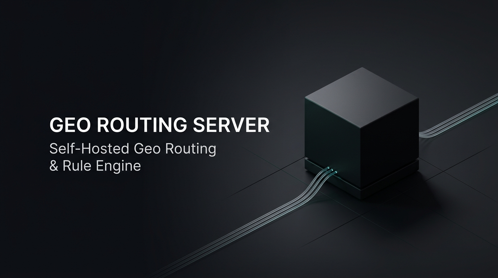
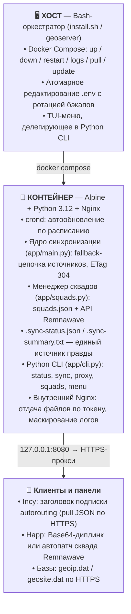

<div align="center">



# 🚀 Geo Routing Server

**Автоматизированный пайплайн и движок синхронизации правил маршрутизации (Happ, Incy) и сквадов Remnawave API с раздачей Geo-баз.**

[](https://github.com/xdeptu5/geo-routing-server)
[](https://github.com/xdeptu5/geo-routing-server/pkgs/container/geo-routing-server)
[](https://www.python.org)
[](https://nginx.org)
[](./LICENSE)
[](https://github.com/xdeptu5/geo-routing-server)

</div>

---

### 💡 Какую рутину автоматизирует сервис

При самостоятельной поддержке актуальных баз и правил администратору приходится решать задачи за пределами возможностей обычного веб-сервера:
1. Регулярно отслеживать upstream-релизы и загружать свежие `geoip.dat` и `geosite.dat`.
2. Парсить исходные JSON-правила и подменять в них внешние URL на адрес своего сервера с секретным токеном.
3. Кодировать правила в Base64 для импорта диплинков Happ (`happ://routing/onadd/...`).
4. При каждом релизе вручную обновлять заголовки маршрутизации в сквадах панели **Remnawave**.

**Geo Routing Server объединяет всю эту цепочку в единый автоматический пайплайн:**

| Задача | Веб-сервер (Caddy / Nginx) | Geo Routing Server |
| :--- | :---: | :---: |
| **Проверка upstream и загрузка по ETag (304)** | ⚠️ Требуются внешние скрипты и cron | ✅ Автоматически по расписанию |
| **Адаптация URL внутри JSON под домен и токен** | ❌ Не входит в задачи веб-сервера | ✅ Автоматически при синхронизации |
| **Генерация Base64-диплинков для клиентов Happ** | ❌ Не входит в задачи веб-сервера | ✅ Автоматически (`.DEEPLINK`) |
| **Обновление заголовков в Remnawave API** | ❌ Требуется отдельный API-скрипт | ✅ Нативно через REST API сквадов |
| **Приватный доступ по токену без листинга** | ⚠️ Требует ручной настройки конфига | ✅ Доступ по токену без листинга включён по умолчанию |
| **Раздача статических файлов по HTTPS** | ✅ Основная функция веб-сервера | ✅ Встроенный Nginx + готовые сниппеты Caddy/Nginx |

> ℹ️ *Caddy или внешний Nginx выполняют свою прямую роль — служат фронтальным HTTPS-прокси с SSL-сертификатом, в то время как контейнер берёт на себя всю логику подготовки данных и интеграций.*

> 📦 **Актуальная версия:** `v1.5.2` (мульти-пресетная раздача, изолированные Geo-базы, автопатч Remnawave).  
> 📜 Полная история версий и изменений доступна в файле [CHANGELOG.md](CHANGELOG.md).

<details>
<summary><b>📑 Содержание</b></summary>
<br>

* [Возможности](#features)
* [Пресеты источников баз и правил](#presets)
* [Архитектура](#architecture)
* [Установка и запуск](#install)
* [Сценарии развертывания](#scenarios)
* [Подключение клиентов](#clients)
* [Настройка HTTPS реверс-прокси](#reverse-proxy)
* [Управление и команды](#management)
* [Разработка и проверки](#dev)
* [FAQ](#faq)
* [Поддержать проект](#donate)
* [Лицензия](#license)

</details>

<a id="features"></a>
## 📌 Возможности

* 🛡️ **Автономность раздачи:** после первой успешной синхронизации базы `geoip.dat`, `geosite.dat` и правила раздаются локально с вашего VPS — клиенты не зависят от доступности GitHub или сторонних CDN (пока данные находятся в локальном volume).
* 📱 **Поддержка Happ и Incy:** генерация Base64-диплинков для Happ (`.DEEPLINK`) и динамических JSON-правил подписки для Incy (`.JSON`).
* ⚡ **Нативная интеграция с Remnawave API:** прямое автообновление правил сквадов без сторонних скриптов (поддерживается до 10+ сквадов и Cloudflare Zero Trust).
* 🔄 **Мульти-пресетная одновременная раздача (A/B тестирование):** параллельная генерация и независимая отдача гео-баз и правил сразу от нескольких источников (`ROUTING_SOURCE_PRESET=hydraponique,geogaga`) в рамках одного токена — для безопасного тестирования новых баз без риска отключения действующих клиентов.
* 🔒 **Безопасность:** закрытый доступ по секретному URL-токену (`/<ROUTING_TOKEN>/...`). Без токена сервер не отвечает сканерам.
* 📁 **Чистые экосистемные пресеты:** правила маршрутизации и гео-базы согласованы на 100% без несовместимых тегов и гибридов:
  - **GeoGaga (Client Flavor)** — *Рекомендуется*: сбалансированный Split-tunneling для РФ, актуальные базы, честные файлы `HAPP.JSON` / `HAPP.DEEPLINK` и `INCY.JSON`.
  - **roscomvpn-routing (hydraponique)** — классический источник (правила `DEFAULT`, `JSONSUB`, `WHITELIST`).
  - **vahellame (Strict Whitelist)** — строгий белый список для максимальных ограничений ТСПУ.
* 📦 **Zero Dependencies:** один контейнер (Alpine + Python 3 + Nginx), архитектуры `amd64` и `arm64`.

---

<a id="presets"></a>
## 🎯 Пресеты источников баз и правил

Каждый пресет является законченной экосистемой. Сервер отдаёт честные имена файлов под выбранный источник:

| Пресет | Источник репозитория | Файлы правил (Happ / Incy) | Теги в geo-базах | Назначение и поведение |
|---|---|---|---|---|
| **`geogaga`**<br>🟢 *Рекомендуется* | `bratishkadrugoimamysynishka/geogaga-client-flavor` | **`HAPP.JSON`** (и `.DEEPLINK`)<br>**`INCY.JSON`** | `geogaga-direct`<br>`geogaga-proxy`<br>`geogaga-block` | **Основной выбор для РФ:** умный сплит-туннель (YouTube, Discord, заблокированные ресурсы — через VPN; банки, Госуслуги, VK, локальные сервисы и CDN — напрямую). |
| **`hydraponique`**<br>📦 *Legacy* | `hydraponique/roscomvpn-routing` | **`JSONSUB.JSON`**<br>**`WHITELIST.JSON`**<br>**`DEFAULT.JSON`** | `category-ru`<br>`ru`<br>`antizapret` | **Классический режим:** старый набор раздельных правил подписки и белого списка. |
| **`vahellame`**<br>🛡️ *Whitelist* | `vahellame/russia-whitelist-routing` | **`WHITELIST.JSON`** | `russia-whitelist` | **Строгий белый список:** для периодов тотальных блокировок и шатдаунов ТСПУ. |

> 💡 **Мульти-пресет (Одновременная раздача нескольких источников):**  
> Вы можете указать несколько пресетов через запятую, например `ROUTING_SOURCE_PRESET=hydraponique,geogaga`.  
> * **Основной пресет** (первый в списке) раздаётся по стандартным путям: `/<TOKEN>/HAPP/` и `/<TOKEN>/INCY/` (100% совместимость со старыми клиентами).  
> * **Вторичные пресеты** изолируются в подкаталогах верхнего регистра: `/<TOKEN>/GEOGAGA/HAPP/` (в диплинки зашиты ссылки на базы geogaga).  
> * **Remnawave:** сквады привязываются к правилам вторичных пресетов (`GEOGAGA/HAPP.JSON`) для бесшовного тестирования.

---

<a id="architecture"></a>
## 📖 Архитектура

Три звена, каждое со своей ответственностью: хост управляет жизненным циклом, контейнер делает всю работу, клиенты только забирают готовый результат.


```mermaid
flowchart TD
    HOST["🖥️ <b>ХОСТ</b> — Bash-оркестратор (install.sh / geoserver)<br/>• Docker Compose: up / down / restart / logs / pull / update<br/>• Атомарное редактирование .env с ротацией бэкапов<br/>• TUI-меню, делегирующее в Python CLI"]
    CONTAINER["🐳 <b>КОНТЕЙНЕР</b> — Alpine + Python 3.12 + Nginx<br/>• crond: автообновление по расписанию<br/>• Ядро синхронизации (app/main.py): fallback-цепочка источников, ETag 304<br/>• Менеджер сквадов (app/squads.py): squads.json + API Remnawave<br/>• .sync-status.json / .sync-summary.txt — единый источник правды<br/>• Python CLI (app/cli.py): status, sync, proxy, squads, menu<br/>• Внутренний Nginx: отдача файлов по токену, маскирование логов"]
    CLIENTS["📱 <b>Клиенты и панели</b><br/>• Incy: заголовок подписки autorouting (pull JSON по HTTPS)<br/>• Happ: Base64-диплинк или автопатч сквада Remnawave<br/>• Базы: geoip.dat / geosite.dat по HTTPS"]

    HOST -->|docker compose| CONTAINER
    CONTAINER -->|"127.0.0.1:8080 → HTTPS-прокси"| CLIENTS
```

---

<a id="install"></a>
## 🚀 Установка и запуск

### ⭐️ Способ 1. Автоматический мастер установки (Рекомендуется)

Самый быстрый и удобный способ развёртывания. Скрипт проверит окружение, сгенерирует криптографически стойкий токен, настроит конфигурацию и запустит сервис:

```bash
# Быстрый запуск в одну строку:
bash <(curl -fsSL https://raw.githubusercontent.com/xdeptu5/geo-routing-server/main/install.sh)
```

<details>
<summary><b>Предпочитаете сначала проверить код скрипта перед запуском?</b></summary>
<br>

Вы можете предварительно скачать и изучить исходный код скрипта:
```bash
curl -fsSLO https://raw.githubusercontent.com/xdeptu5/geo-routing-server/main/install.sh
less install.sh      # аудит кода скрипта
bash install.sh      # запуск установки
```
</details>


> 💡 **Удобное управление через команду `geoserver`:**  
> После установки в любой момент введите `geoserver` в терминале для вызова интерактивной панели:
> * 📊 **Мониторинг:** просмотр статуса, логов в реальном времени и публичных ссылок на файлы
> * ⚙️ **Настройки по разделам:** клиенты и правила, подключение, расписание, источники данных и интеграции меняются независимо
> * 🌐 **HTTPS Реверс-прокси:** встроенный генератор готовых конфигов для **Caddy** и **Nginx**
> * 🔄 **Обновления:** отдельное или совместное обновление скрипта и Docker-образа без перезаписи `.env`

---

<details>
<summary><b>🛠️ Способ 2. Ручной запуск через Docker Compose (Portainer / Dockge / 1Panel)</b></summary>
<br>

Если вы управляете стеками через **Dockge**, **Portainer**, **1Panel**, **Coolify** или разворачиваете сервис через CI/CD:

1. **Создайте `compose.yaml`:**
   ```yaml
   services:
     geo-routing-server:
       image: ghcr.io/xdeptu5/geo-routing-server:latest
       container_name: geo-routing-server
       restart: unless-stopped
       env_file:
         - .env

       # Для прямого подключения к сети панели Remnawave раскомментируйте:
       # networks:
       #   - remnawave

       ports:
         - "${HTTP_BIND:-127.0.0.1}:${HTTP_PORT:-8080}:80"
       volumes:
         - routing_data:/app/www
         - ./.cache:/app/.cache
       healthcheck:
         test: ["CMD", "wget", "-q", "-O", "/dev/null", "http://127.0.0.1:80/health"]
         interval: 30s
         timeout: 5s
         retries: 3
         start_period: 10s
       logging:
         driver: "json-file"
         options:
           max-size: "10m"
           max-file: "3"

   volumes:
     routing_data:

   # Раскомментируйте вместе с блоком networks в сервисе выше:
   # networks:
   #   remnawave:
   #     external: true
   #     name: "${DOCKER_NETWORK:-remnawave-network}"
   ```

2. **Создайте файл конфигурации `.env`:**  
   Скопируйте шаблон из [`.env.example`](./.env.example) и настройте базовые параметры:
   ```env
   DOMAIN=geo.example.com
   ROUTING_TOKEN=сгенерируйте_случайный_токен_openssl_rand_hex_16
   ENABLED_CLIENTS=HAPP,INCY
   ROUTING_SOURCE_PRESET=geogaga
   ROUTING_RULES=HAPP
   SERVE_FORMATS=CLIENT_OPTIMIZED
   HTTP_PORT=8080
   SCHEDULE=0 10 * * *
   SYNC_ON_START=true
   ```

3. **Запустите контейнер:**
   ```bash
   docker compose up -d
   ```

4. **Проверьте работоспособность:**
   ```bash
   docker compose ps
   curl -fsS http://127.0.0.1:8080/health
   docker compose logs --tail=50
   ```
   > Статус `healthy` и строка `Synchronization completed successfully.` в логах подтверждают успешный запуск.

</details>


---

<a id="scenarios"></a>
## 🗺️ Сценарии развертывания

Сервис гибко настраивается под любую архитектуру сети через файл `.env` (или интерактивно в мастере `install.sh`):

| Сценарий | Название режима | Когда использовать | Основной модуль (`ENABLED_CLIENTS`) |
| :---: | :--- | :--- | :--- |
| **1** | **Всё в одном** | Раздача баз и правил по HTTPS + автопатч сквадов Remnawave | `HAPP,INCY` + Remnawave API |
| **2** | **Сервер раздачи** | Автономная раздача баз и правил по HTTPS (без Remnawave) | `HAPP,INCY` (или только один клиент) |
| **3** | **Выделенный узел баз (Geo-Node)** | Раздача только файлов `geoip.dat` и `geosite.dat` на высокой скорости | `HAPP_GEO,INCY_GEO` |
| **4** | **Интеграция с Remnawave** | Генератор диплинков для сквадов Remnawave (базы на внешнем сервере) | `HAPP_DEEPLINK` (домен не требуется) |
| **5** | **Только правила Incy** | Раздача JSON-подписки Incy по HTTPS, базы на внешнем узле | `INCY` + `PUBLIC_GEO_BASE_URL` |

<details>
<summary><b>📋 Примеры готовых конфигураций .env под каждый сценарий</b></summary>
<br>

#### 1. Всё в одном (Раздача файлов + Remnawave API)
Раздаёт базы и правила по HTTPS, а также автоматически обновляет правила маршрутизации в сквадах панели Remnawave:
```env
DOMAIN=geo.example.com
ROUTING_TOKEN=секретный_токен
ENABLED_CLIENTS=HAPP,INCY
ROUTING_SOURCE_PRESET=geogaga
ROUTING_RULES=HAPP
SERVE_FORMATS=CLIENT_OPTIMIZED
REMNAWAVE_BASE_URL=http://remnawave:3000/api
REMNAWAVE_TOKEN=jwt_токен_администратора
REMNAWAVE_SQUAD_1_UUID=uuid_первого_сквада
REMNAWAVE_SQUAD_1_RULE=HAPP.JSON
```

#### 2. Сервер раздачи (Pull-модель без Remnawave)
Классический файловый сервер. Базы и конфигурации забираются клиентами и панелями (Marzban, 3x-ui, Remnawave) по прямым HTTPS-ссылкам:
```env
DOMAIN=geo.example.com
ROUTING_TOKEN=секретный_токен
ENABLED_CLIENTS=HAPP,INCY
ROUTING_SOURCE_PRESET=geogaga
ROUTING_RULES=HAPP
SERVE_FORMATS=CLIENT_OPTIMIZED
```

#### 3. Выделенный узел раздачи geo-баз (Geo-Node)
Сервер раздаёт только базы `geoip.dat` и `geosite.dat` без генерации правил маршрутизации (минимальная нагрузка):
```env
DOMAIN=geo-node.example.com
ROUTING_TOKEN=секретный_токен
ENABLED_CLIENTS=HAPP_GEO,INCY_GEO
ROUTING_SOURCE_PRESET=geogaga
```

#### 4. Интеграция с Remnawave (базы на внешнем узле)
Работает в изолированном Docker-окружении рядом с Remnawave. **Публичный домен и открытые веб-порты не требуются.** Правила генерируются и сразу пушатся в API сквадов:
```env
ENABLED_CLIENTS=HAPP_DEEPLINK
ROUTING_SOURCE_PRESET=geogaga
ROUTING_RULES=HAPP
PUBLIC_GEO_BASE_URL=https://geo-node.example.com/секретный_токен
REMNAWAVE_BASE_URL=http://remnawave:3000/api
REMNAWAVE_TOKEN=jwt_токен_администратора
REMNAWAVE_SQUAD_1_UUID=uuid_сквада
REMNAWAVE_SQUAD_1_RULE=HAPP.JSON
```

#### 5. Сервер правил Incy (с внешними базами)
Раздает по HTTPS JSON-правила для Incy, а адреса загрузки баз внутри правил ведут на выделенный гео-узел:
```env
DOMAIN=geo.example.com
ROUTING_TOKEN=секретный_токен
ENABLED_CLIENTS=INCY
ROUTING_SOURCE_PRESET=geogaga
PUBLIC_GEO_BASE_URL=https://geo-node.example.com/секретный_токен
```

#### 6. Мульти-пресет: одновременная раздача двух и более источников
Позволяет тестировать новые базы (например, GeoGaga), **не отключая действующих клиентов** от Hydraponique, в рамках одного контейнера:
```env
DOMAIN=geo.example.com
ROUTING_TOKEN=секретный_токен
ENABLED_CLIENTS=HAPP,INCY
ROUTING_SOURCE_PRESET=hydraponique,geogaga
```
* **Основной пресет (`hydraponique`):** отдаётся по стандартным путям (100% совместимость со всеми текущими клиентами):
  * `https://<DOMAIN>/<TOKEN>/HAPP/`
  * `https://<DOMAIN>/<TOKEN>/INCY/`
* **Вторичный пресет (`geogaga`):** изолирован в собственном пространстве путей:
  * `https://<DOMAIN>/<TOKEN>/GEOGAGA/HAPP/` (в диплинки зашиты ссылки на `.../GEOGAGA/HAPP/geoip.dat`)
  * `https://<DOMAIN>/<TOKEN>/GEOGAGA/INCY/`
* **В Remnawave:** для тестового сквада в `squads.json` или меню укажите правило `GEOGAGA/HAPP.JSON` (или просто `HAPP.JSON` — сервер найдет его автоматически).

</details>


---

<a id="clients"></a>
## 📱 Подключение клиентов

### HAPP
Happ принимает правила через Base64-диплинк `happ://routing/onadd/<base64>`.
* **С Remnawave:** правила обновляются в сквадах автоматически через API (Сценарии 1 и 4).
* **Вручную / другие панели:** скопируйте ссылку на сгенерированный файл:
  ```text
  https://<DOMAIN>/<ROUTING_TOKEN>/HAPP/<RULE>.DEEPLINK
  ```
  **GeoGaga (Рекомендуется):**
  * `https://geo.example.com/<ROUTING_TOKEN>/HAPP/HAPP.DEEPLINK`

  **hydraponique (Legacy):**
  * `https://geo.example.com/<ROUTING_TOKEN>/HAPP/JSONSUB.DEEPLINK`
  * `https://geo.example.com/<ROUTING_TOKEN>/HAPP/WHITELIST.DEEPLINK`

  **Мульти-пресет (Вторичный источник, например GeoGaga):**
  * `https://geo.example.com/<ROUTING_TOKEN>/GEOGAGA/HAPP/HAPP.DEEPLINK`

### INCY
Клиент Incy динамически скачивает JSON-правила по HTTPS. В панели (Remnawave, Marzban, 3x-ui) добавьте заголовок профиля подписки:
* **Header Name:** `autorouting`
* **Header Value:**
  ```text
  incy://autorouting/onadd/https://<DOMAIN>/<ROUTING_TOKEN>/INCY/<RULE>.JSON
  ```
  **GeoGaga (Рекомендуется):**
  * `incy://autorouting/onadd/https://geo.example.com/<ROUTING_TOKEN>/INCY/INCY.JSON`

  **hydraponique (Legacy):**
  * `incy://autorouting/onadd/https://geo.example.com/<ROUTING_TOKEN>/INCY/JSONSUB.JSON`
  * `incy://autorouting/onadd/https://geo.example.com/<ROUTING_TOKEN>/INCY/WHITELIST.JSON`

  **Мульти-пресет (Вторичный источник, например GeoGaga):**
  * `incy://autorouting/onadd/https://geo.example.com/<ROUTING_TOKEN>/GEOGAGA/INCY/INCY.JSON`

---

<details>
<summary><b>⚙️ Полный справочник всех параметров конфигурации (.env)</b></summary>
<br>

| Переменная | По умолчанию | Описание |
| :--- | :--- | :--- |
| `DOMAIN` | `geo.example.com` | Домен для HTTPS-прокси (не нужен в режиме `HAPP_DEEPLINK`) |
| `ROUTING_TOKEN` | — | **Обязательно** для раздачи файлов: минимум 4 символа из `[A-Za-z0-9_-]`; установщик генерирует 32-символьный токен |
| `ENABLED_CLIENTS` | `HAPP,INCY` | Модули: `HAPP,INCY`, `HAPP`, `INCY`, `HAPP_GEO`, `INCY_GEO`, `HAPP_DEEPLINK` |
| `ROUTING_SOURCE_PRESET` | `geogaga` | Пресет источников: `geogaga` (Рекомендуется), `hydraponique` (Legacy), `vahellame` (Strict Whitelist), `custom` или несколько через запятую для мульти-пресета (например, `hydraponique,geogaga`) |
| `ROUTING_RULES` | *пусто* (все правила источника) | Выборочные правила через запятую (`HAPP`/`INCY` для geogaga; `JSONSUB,WHITELIST` для hydraponique; `WHITELIST` для vahellame); `ALL` или пусто — все правила источника. Мастер установки записывает значение, соответствующее пресету |
| `SERVE_FORMATS` | `CLIENT_OPTIMIZED` | Форматы файлов: `CLIENT_OPTIMIZED` (Happ → `.DEEPLINK`, Incy → `.JSON`), `ALL`, `JSON`, `DEEPLINK` |
| `SERVE_GEOIP` | `true` | Раздача файла `geoip.dat` (`true` / `false`) |
| `SERVE_GEOSITE` | `true` | Раздача файла `geosite.dat` (`true` / `false`) |
| `PUBLIC_GEO_BASE_URL` | *пусто* | Внешний URL баз (`https://geo-node.example.com/<token>`) |
| `DOCKER_NETWORK` | `remnawave-network` | Имя существующей сети Remnawave; применяется блоком `networks` в `compose.yaml` |
| `HTTP_BIND` | `127.0.0.1` | IP привязки внутреннего веб-сервера |
| `HTTP_PORT` | `8080` | Порт для реверс-прокси |
| `SCHEDULE` | `0 10 * * *` | Расписание автообновления (cron UTC, дефолт 10:00 UTC) |
| `SYNC_ON_START` | `true` | Выполнять синхронизацию при запуске контейнера |
| **Telegram** | | |
| `TELEGRAM_BOT_TOKEN` | *пусто* | Токен бота Telegram для алертов |
| `TELEGRAM_CHAT_ID` | *пусто* | ID чата / группы |
| `TELEGRAM_THREAD_ID` | *пусто* | ID темы/топика в супергруппе |
| `TELEGRAM_NOTIFY_SUCCESS`| `false` | Уведомлять при каждом успешном обновлении |
| **Remnawave API** | | |
| `REMNAWAVE_BASE_URL` | *пусто* | URL API панели (например, `http://remnawave:3000/api`) |
| `REMNAWAVE_TOKEN` | *пусто* | JWT-токен администратора панели |
| `REMNAWAVE_GLOBAL_RULE` | *пусто* | Глобальное правило для всех подписок |
| `GITHUB_RAW_URL` | *пусто* | *(Legacy)* Старое имя `REMNAWAVE_GLOBAL_RULE`, используется как фолбэк |
| `CLOUDFLARE_ZERO_TRUST_CLIENT_ID` | *пусто* | Client ID сервисного токена Cloudflare Zero Trust |
| `CLOUDFLARE_ZERO_TRUST_CLIENT_SECRET` | *пусто* | Client Secret сервисного токена Cloudflare Zero Trust |
| `REMNAWAVE_SQUAD_N_UUID` | *пусто* | *(Legacy)* UUID сквада N (N = 1..10+). Рекомендуется использовать `squads.json` |
| `REMNAWAVE_SQUAD_N_NAME` | *пусто* | *(Legacy)* Читаемое имя сквада N |
| `REMNAWAVE_SQUAD_N_RULE` | `HAPP.JSON` | *(Legacy)* Имя правила для сквада N |
| `SQUADS_FILE` | *пусто* (`STORAGE_DIR/.squads.json`) | Нестандартный путь к файлу привязок сквадов |

> ⚡ **Управление сквадами (`squads.json`):**  
> Начиная с версии 1.4.0 привязки сквадов хранятся в структурированном файле `squads.json` (вместо ручного редактирования `.env`):
> ```json
> [
>   { "uuid": "c0a80101-0000-0000-0000-000000000001", "rule": "HAPP.JSON", "name": "VIP Users" }
> ]
> ```
> Управление сквадами осуществляется через пункт меню `4` в `geoserver` либо через Python CLI внутри контейнера:
> ```bash
> # Просмотр, добавление или миграция из .env:
> docker compose exec geo-routing-server python -m app.cli squads list
> docker compose exec geo-routing-server python -m app.cli squads add --uuid <UUID> --rule HAPP.JSON --name "VIP"
> docker compose exec geo-routing-server python -m app.cli squads migrate
> ```
> Начиная с `v1.5.2` файл хранится внутри примонтированного тома (`routing_data`), а не в слое контейнера — привязки сквадов переживают `docker compose pull`/`up` и `geoserver update`. Нестандартный путь можно задать через `SQUADS_FILE=/путь/squads.json` в `.env`.

</details>

---

<a id="reverse-proxy"></a>
## 🌐 Настройка HTTPS Реверс-Прокси

Поддерживаются два основных сценария подключения:
1. **Отдельный субдомен** (например, `geo.example.com`).
2. **Существующий сайт** (проксирование только путей `/<ROUTING_TOKEN>/` без выделения нового домена).

> 💡 **Автоматическая генерация конфигов:**  
> Интерактивный генератор готовых конфигов под ваш домен и порт встроен прямо в меню `geoserver` (пункт `8` или команда `geoserver proxy`).

<details>
<summary><b>📄 Примеры конфигураций для Caddy и Nginx</b></summary>
<br>

**Вариант 1: Выделенный поддомен (geo.example.com):**

*Caddy:*
```caddy
geo.example.com {
    reverse_proxy 127.0.0.1:8080
}
```

*Nginx:*
```nginx
server {
    listen 443 ssl;
    server_name geo.example.com;
    ssl_certificate /etc/letsencrypt/live/geo.example.com/fullchain.pem;
    ssl_certificate_key /etc/letsencrypt/live/geo.example.com/privkey.pem;

    location / {
        proxy_pass http://127.0.0.1:8080;
        proxy_http_version 1.1;
        proxy_set_header Host $host;
        proxy_set_header X-Real-IP $remote_addr;
        proxy_set_header X-Forwarded-For $proxy_add_x_forwarded_for;
        proxy_set_header X-Forwarded-Proto $scheme;
    }
}
```

<br>

**Вариант 2: Общий домен с другим сайтом (проксирование по токену):**

*Если корень `location /` уже занят вашим сайтом или панелью:*
```nginx
location /<ROUTING_TOKEN>/ {
    proxy_pass http://127.0.0.1:8080;
    proxy_http_version 1.1;
    proxy_set_header Host $host;
    proxy_set_header X-Real-IP $remote_addr;
    proxy_set_header X-Forwarded-For $proxy_add_x_forwarded_for;
    proxy_set_header X-Forwarded-Proto $scheme;
}
```

</details>


---

<a id="management"></a>
## 🛠️ Управление и команды

Основное администрирование выполняется через интерактивное меню `geoserver`:

Меню использует обычный ввод номера. `Enter` принимает предложенный вариант, `0` возвращает назад, если такой пункт предусмотрен.

| Действие | Команда / пункт меню | Описание |
|---|---|---|
| **Главное меню** | `geoserver` | Интерактивное нумерованное меню управления сервером |
| **Статус и ссылки** | `geoserver status` или пункт `1` | Состояние контейнера и готовые ссылки для клиентов |
| **Синхронизация** | `geoserver sync` или пункт `2` | Принудительное обновление баз и правил |
| **Логи** | `geoserver logs` или пункт `3` | Просмотр логов контейнера в реальном времени |
| **Сквады Remnawave** | Пункт `4` | Добавление, редактирование, удаление и просмотр сквадов |
| **Расписание** | Пункт `5` | Настройка расписания автообновления правил через cron |
| **Telegram-уведомления** | Пункт `6` | Настройка токена бота и Chat ID для уведомлений |
| **Клиенты и базы** | Пункт `7` | Выбор активных клиентов, форматов и источников geo-баз |
| **Конфиги реверс-прокси** | `geoserver proxy` или пункт `8` | Генератор готовых сниппетов для Caddy и Nginx |
| **Центр обновлений** | `geoserver update` или пункт `9` | Обновление Docker-образа (`update-image`), скрипта (`update-script`) или всего (`update-all`) |
| **Перезапуск** | `geoserver restart` или пункт `10` | Перезапуск контейнера с применением настроек `.env` |
| **Управление контейнером** | `geoserver start` / `stop` или пункт `11` | Запуск или остановка контейнера (пункт меняется на "Запустить" / "Остановить" по текущему состоянию) |
| **Редактирование .env** | `geoserver config` / `edit` или пункт `12` | Прямое редактирование конфигурационного файла |
| **Удаление сервиса** | `geoserver uninstall` или пункт `13` | Остановка и полное удаление сервиса и скрипта |
| **Выход** | Пункт `0` | Выход из меню |

> 💡 **Проверка обновлений — по запросу, не автоматически:**  
> Меню `geoserver` не опрашивает GitHub или GHCR само при открытии. Сравнение версии скрипта с GitHub выполняется только при явном запуске пункта `9` / `geoserver update-script` (или `update-all`); проверки версии Docker-образа нет — `docker compose pull` всегда просто забирает тег `latest`.

<details>
<summary><b>🐍 Управление напрямую через Python CLI внутри контейнера (без install.sh)</b></summary>
<br>

Если вы разворачиваете проект без скрипта `install.sh` (через **Portainer**, **Dockge**, **1Panel**, **Kubernetes**), вам доступен полный встроенный Python CLI стандартной библиотеки:

```bash
# Интерактивное TUI-меню в терминале:
docker compose exec -it geo-routing-server python -m app.cli menu

# Просмотр статуса и ссылок (текстовый вид или машиночитаемый JSON):
docker compose exec geo-routing-server python -m app.cli status
docker compose exec geo-routing-server python -m app.cli status --json

# Принудительная синхронизация:
docker compose exec geo-routing-server python -m app.cli sync

# Генератор конфигов для Caddy и Nginx:
docker compose exec geo-routing-server python -m app.cli proxy

# Управление сквадами Remnawave (squads.json):
docker compose exec geo-routing-server python -m app.cli squads list
docker compose exec geo-routing-server python -m app.cli squads add --uuid <UUID> --rule HAPP.JSON --name "VIP"
docker compose exec geo-routing-server python -m app.cli squads remove --uuid <UUID>
docker compose exec geo-routing-server python -m app.cli squads migrate
```
</details>


---

<a id="dev"></a>
## 🧪 Разработка и проверки

Все проверки запускаются из корня репозитория. Версии зафиксированы (Python 3.12, `ruff==0.16.9`, `pytest==9.1.1`) и совпадают с тем, что ставит CI:

```bash
ruff check app tests            # линтер (конфиг — ruff.toml)
python -m pytest -q             # юнит-тесты (203 теста в tests/)
python -m compileall app        # синтаксис всех модулей без запуска
bash -n install.sh docker-entrypoint.sh   # синтаксис shell-скриптов
shellcheck -S warning install.sh docker-entrypoint.sh  # статический анализ (нужен shellcheck)
```

Тесты не ходят в сеть, не запускают Docker и не читают `.env`: они изолируют переменные окружения и проверяют всю логику компонентов `app/*`, включая CLI, менеджер сквадов, загрузчик, нормализацию диплинков и fallback геобаз.

CI (`.github/workflows/docker.yml`) на каждый push в `main`, тег, pull request и запуск вручную:

| Задача | Что делает |
| --- | --- |
| **Python: ruff lint + pytest** | `ruff check app`, `python -m pytest -q` (203 теста), `python -m compileall app` |
| **Shellcheck (install.sh, docker-entrypoint.sh)** | `shellcheck -S warning` обоих скриптов |
| **Build and publish Docker image** | сборка и публикация образа (GHCR/Docker Hub) — только на push/тег/ручной запуск, после успешного линтинга и shellcheck; на pull request не собирается |

<a id="faq"></a>
## ❓ FAQ

<details>
<summary><b>Как устроена защита токеном и доступ к файлам?</b></summary>
Прямой просмотр каталогов (листинг файлов) отключён. При обращении к корню сервер отдаёт статус <code>geo-routing-server is running</code>. Все базы и конфигурации отдаются исключительно по секретному URL-префиксу: <code>https://geo.example.com/&lt;ROUTING_TOKEN&gt;/...</code>. Без знания токена сканеры и сторонние лица не имеют доступа к вашим файлам.
</details>

<details>
<summary><b>Что происходит при повторном запуске install.sh?</b></summary>

<b>Запуск без аргументов:</b> если установка уже обнаружена (есть <code>.env</code> и <code>compose.yaml</code>), скрипт открывает меню <code>geoserver</code> и ничего не перезаписывает.<br><br>
<b>Явный повторный запуск визарда</b> (<code>install.sh install</code>): существующие <code>.env</code> и <code>compose.yaml</code> сначала сохраняются в резервные копии (<code>.env.bak.&lt;дата-время&gt;</code>, <code>compose.yaml.bak.&lt;дата-время&gt;</code> — об этом сообщается в выводе), прежние значения подставляются в качестве дефолтов ответов визарда, а ключи, которые визард не спрашивает (например, <code>TELEGRAM_*</code>), переносятся из старого файла в новый. Docker volume с данными визард не затрагивает.
</details>

---

<a id="donate"></a>
## 💎 Поддержать проект (Donations)

* **USDT / TRX (TRC20):** `TKw6b3ZszCM2983sLuFAvqxtt2M8hpNW51`
* **TON:** `UQB19xcTuQ1jFEq0Pi3xaABnN8JaGEXAeuGa2rXFRUUdi8Nk`
* **USDT / BNB (BEP20):** `0xFdc848534deA4f010c95df92045ABDa5f6a1559b`

---

<a id="license"></a>
## 📄 Лицензия

Распространяется под свободной лицензией [MIT](./LICENSE).


